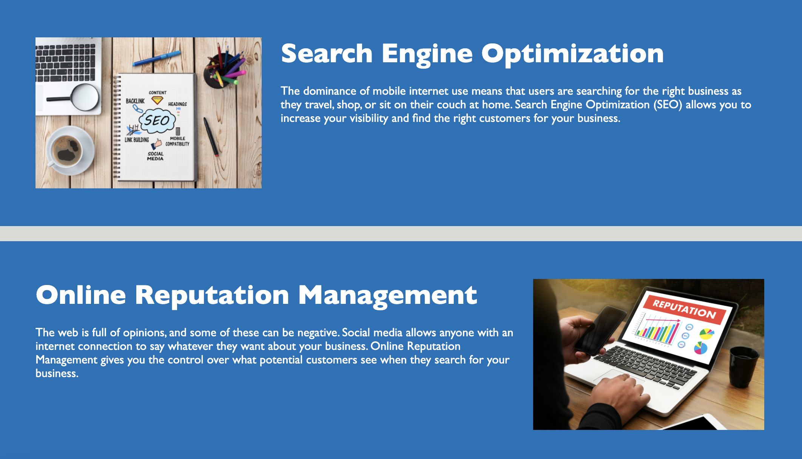

# Week 1 Challenge

## Description

The goal of this project was to refactor the code that was given to me. I examined and improved the existing code to help the understanding of the code. I learned that any little changes you make to the html could possibly directly affect the CSS. Therefore, I had to perform a bit of debugging to fix the areas that connect to to the html that i changed.

## Installation

N/A

## Usage

In this screenshot you see three different tabs. If you click on one of them it will jump to the linked part of the page which is shown in the second screen shot

Screenshot 1

Screenshot 2

## Credits

N/A

## License

Refer to the license in the repo.

## Features

N/A

## Link To Final Product

https://kipschetnan.github.io/Week-1-Challenge/02-Challenge/Develop/

